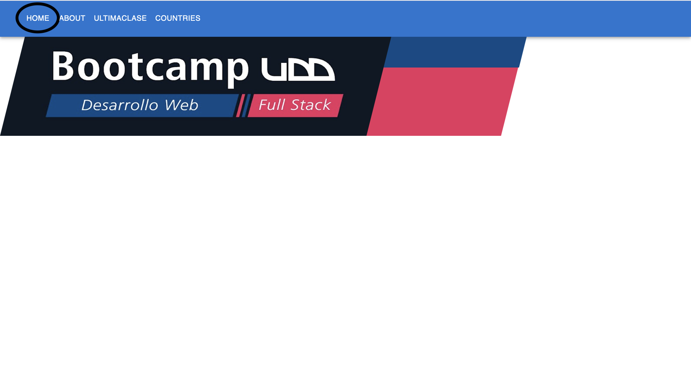
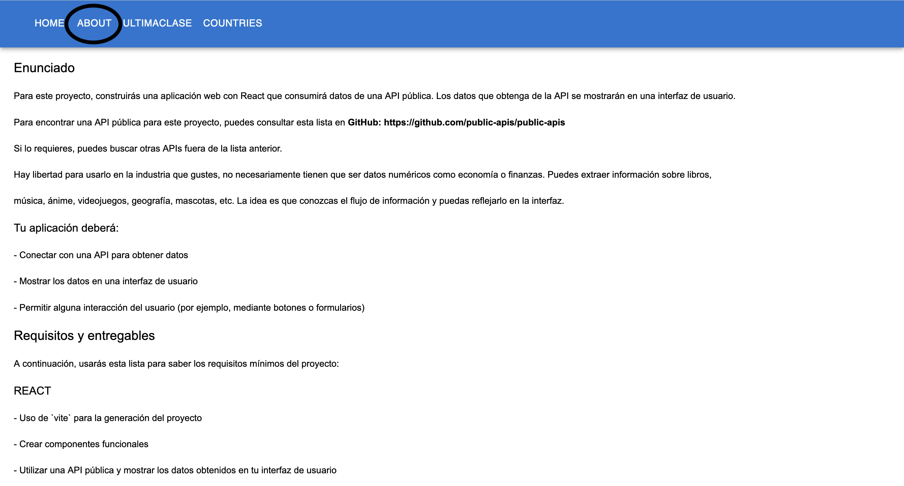
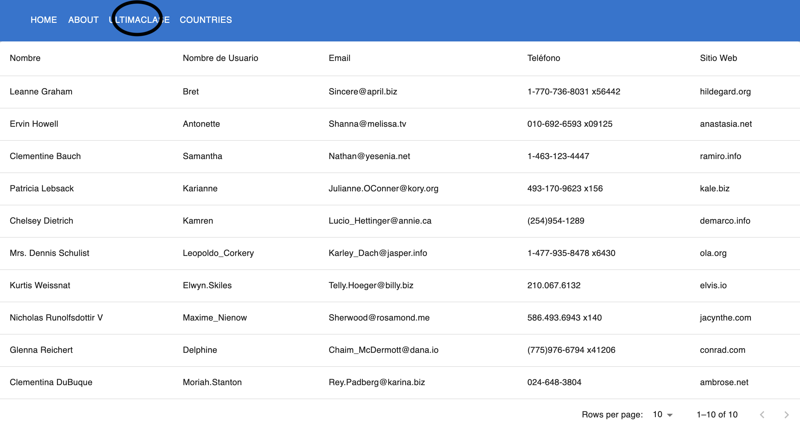
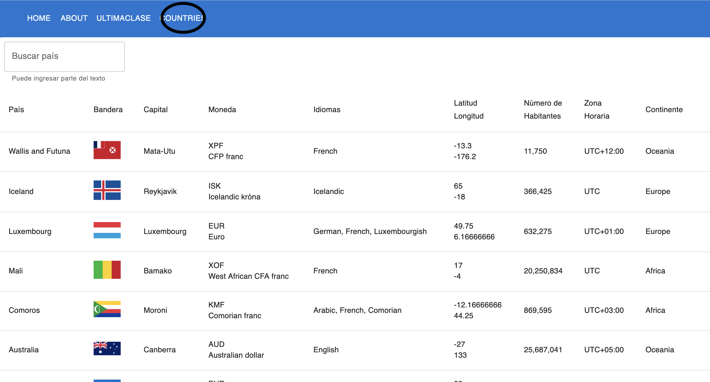
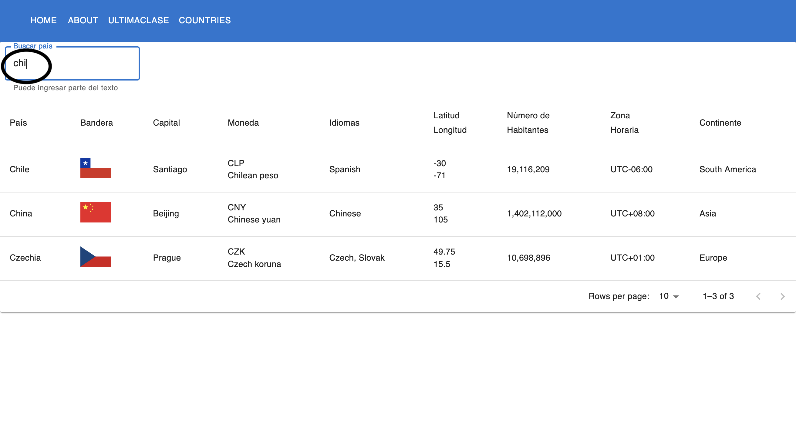

# PROYECTO 5: Aplicación Web con React

GitHub  `https://github.com/ASobrinoB/M5_PROY.git`

Netlify `https://ubiquitous-sundae-504680.netlify.app`

## **ÍNDICE**

* [1. Enunciado](#1-Enunciado)
* [2. Requisitos](#2-requisitos-y-entregables)
* [3. Entrega](#3-entrega)

****

## 1. Enunciado

Para este proyecto, construirás una aplicación web con React que consumirá datos de una API pública. Los datos que obtenga de la API se mostrarán en una interfaz de usuario.

Para encontrar una API pública para este proyecto, puedes consultar esta lista en GitHub: https://github.com/public-apis/public-apis

Si lo requieres, puedes buscar otras APIs fuera de la lista anterior.

Hay libertad para usarlo en la industria que gustes, no necesariamente tienen que ser datos numéricos como economía o finanzas. Puedes extraer información sobre libros, música, ánime, videojuegos, geografía, mascotas, etc. La idea es que conozcas el flujo de información y puedas reflejarlo en la interfaz.

Tu aplicación deberá:

- Conectar con una API para obtener datos
- Mostrar los datos en una interfaz de usuario
- Permitir alguna interacción del usuario (por ejemplo, mediante botones o formularios)

****

## 2. Requisitos y entregables

A continuación, usarás esta lista para saber los requisitos mínimos del proyecto:

### REACT

- [ ] Uso de `vite` para la generación del proyecto
- [ ] Crear componentes funcionales
- [ ] Utilizar una API pública y mostrar los datos obtenidos en tu interfaz de usuario
- [ ] Uso de Hooks (mínimo `useEffect` para los procesos asíncronos)
- [ ] Implementar rutas en tu aplicación con `React Router`
- [ ] Manejar errores de renderizado con `Error Boundaries`
- [ ] Implementación CSS a través de un framework (`TailwindCSS`, `MUI`, `Bootstrap`)

### CONTROL DE VERSIONES
- [ ] Crear un repositorio en GitHub y Realizar mínimo 5 "commits" por persona en tu repositorio
- [ ] Crear un `README.md` dentro del repositorio. Incluir la descripción, instalación y uso del proyecto

### DESPLIEGUE
- [ ] Mostrar proyecto a través de una URL, usando un servicio de terceros (Netlify, GitHub Pages, Render)

### ENTREGA A TIEMPO
- [ ] Entregar tu proyecto en el tiempo estipulado

****

## 3. Entrega

### PANTALLAS

### EL EJERCICIO QUE HICIMOS EN CLASES

### IMPLEMENTACION DE LA API   `https://restcountries.com/v3.1/all`

### REALIZANDO UNA BUSQUEDA

